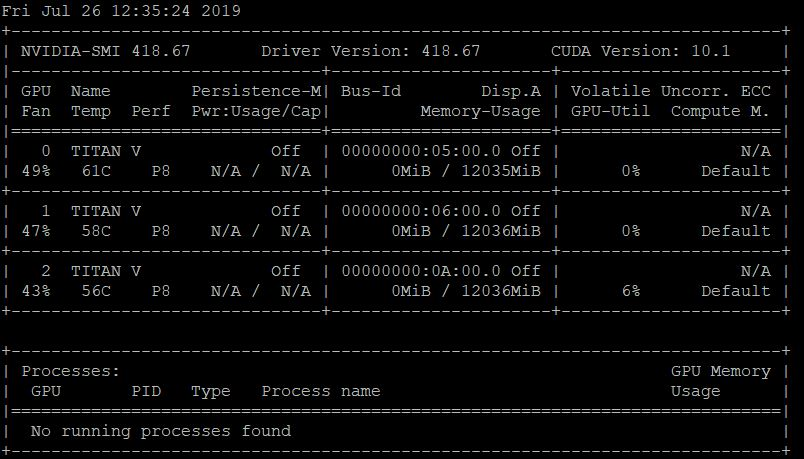
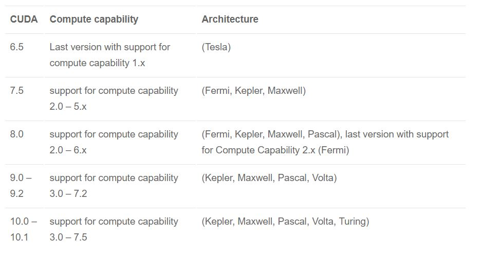

### for gpu user  

예를 들어  다음 파일을 실행시키고자 한다면,
`
python test.py 
`

```python
import tensorflow as tf
import cv2
import numpy as np 
```


목표는 다음 환경을 설정하는 것이다. 
*ubuntu 위 python + python packages(PIL,numpy,scipy,tensorflow-gpu...) + CUDA + CUDNN*
이때 각 패키지 사이의 버전 충돌이 주 문제가 되므로, 버전을 미리 맞춰서 깔아야 한다. 
나의 경우 ubuntu 및 python 설치가 되어있는 서버를 이용했다.
없다면 설치하도록 하자.  

다음 커맨드로 새팅을 확인하자.
`apt --installed list` 

***


1. (기본 작업) 우분투 버전 확인
`$ cat /etc/issue`  
`Ubuntu 16.04.5 LTS \n \l`    

2. CUDA,CUDNN 설치 - GPU 확인 


`$ nvidia-smi`   



GPU종류에 따라 compute capability 를 확인하여 CUDA를 설치해야한다. ($sudo)  
https://developer.nvidia.com/cuda-gpus     



이제 다음과 같은 환경이 만들어 졌다.  
`CUDA 10  
CUDNN 7
python3'  


3. python packages(PIL,numpy,scipy,tensorflow-gpu...)
pip 이라는 설치 도구로 편리하게 install 가능하나,  
버전 문제 해결을 간편하게 하기 위해 venv 로 가상 환경을 설정 후 설치 하자  
이 때, tensorflow가 아닌 tensorflow-gpu를 설치 해야 한다는 것을 기억하자.


아래 가이드가 잘 나와 있다.
https://www.tensorflow.org/install/pip


